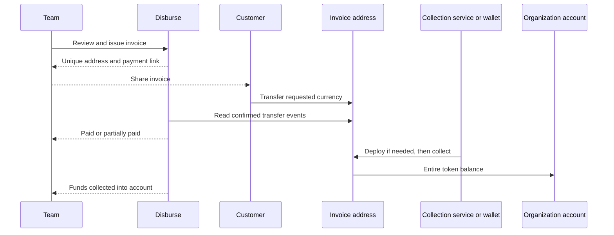

# Customer invoices and collections

**Updated September 8, 2026:** invoice creation, receiving-address provisioning and collection follow the [product-wide service boundary](PRODUCT_AND_SERVICE_REQUIREMENTS.md). The issuer pays any creation-service cost in stablecoins when creating the invoice. Current issuance only predicts an address; it has no receiving-contract deployment cost at issuance. First collection deploys that contract. Receiving setup and collection now quote a bounded USDC fee and charge the customer Safe through Circle Paymaster and the public Candide bundler. Actual Base Sepolia execution passed with zero native balances. Disburse must not fund a factory, collection or indexing service on the customer's behalf.

## Product behavior

**Invoices** is accounts receivable: create a draft, review its items and receiving account, generate a payment link, share it, and track payment. **Bills** remains accounts payable. The customer can view and print the invoice without creating a Disburse account.

Each issued invoice preserves its original amount, currency, network, destination account and unique receiving address. Issued credit notes reduce the remaining amount requested without editing that original record. Drafts can be edited; issued payment instructions cannot. An invoice can receive several partial payments. Overpayments and payments arriving after voiding remain visible. Customer email is kept out of the public page, and links are unguessable bearer tokens. Anyone with the link can see the shared invoice; treat it as a document link, not an authenticated customer portal.

Received and collected are separate amounts. A confirmed payment satisfies the invoice even if collection into the main account has not completed. Collection never counts as another customer payment. No fee is deducted from the invoice principal by the current contract. This is an implementation choice, not a promise that invoicing will always have no service fee. Pricing remains open; no new service charge is enabled.

## Receiving-address options

| Approach | Customer experience | Authority and recovery | Cost/tradeoff |
| --- | --- | --- | --- |
| Separate ordinary wallet per invoice | Normal transfer to a unique address | Requires private-key generation, backup and transaction signing. A server holding keys would control receipts. | No contract deployment, but key custody and native-gas funding for every sweep are substantial operational obligations. Does not fit the current architecture. |
| Separate Safe per invoice | Normal transfer to a unique address | Customer-controlled account with owner configuration | Repeats account setup and deployment per invoice; more configuration than collection requires. |
| Shared account plus invoice-reference payment contract | Pay a contract method with an invoice identifier | Customer controls treasury; attribution recorded by router | Avoids per-invoice deployment, but an ordinary exchange withdrawal cannot include that contract call. Shared-address transfers without the reference are ambiguous. Worth retaining for customers paying through a compatible wallet. |
| Deterministic receiving contract per invoice | Normal transfer to a unique address; no reference copying | Immutable destination, permissionless collection, no operator key controlling receipts | Contract deployment on first collection, then gas for each later collection. Chosen for predictable attribution from normal token transfers. |

The address is computed using CREATE2 from the factory, invoice salt, and creation code containing the destination account. The same factory and salt with another destination produce another address. An address can receive tokens before its code is deployed. The system checks both local derivation and the deployed factory's prediction before issuing instructions. [CREATE2 specification](https://eips.ethereum.org/EIPS/eip-1014).

The first implementation uses a small, fully deployed contract with an immutable constructor argument. Minimal proxies could reduce deployment gas, but add an implementation dependency and initialization considerations. Benchmark a clone variant before changing the design; lower gas alone is not enough reason to introduce a destination-initialization failure mode. [OpenZeppelin proxy and clone documentation](https://docs.openzeppelin.com/contracts/5.x/api/proxy).

## Collection and gas

ERC-20 transfers do not require a callback into the receiving address. Consequently a plain transfer does not automatically forward itself. A later transaction must call the collection function. The contract uses SafeERC20 to support tokens with standard boolean returns and common tokens without a return value; unsuccessful transfers revert. Only the invoice's configured canonical token is credited toward payment. [ERC-20 specification](https://eips.ethereum.org/EIPS/eip-20), [OpenZeppelin SafeERC20](https://docs.openzeppelin.com/contracts/5.x/api/token/erc20).

There are three distinct costs: a shared factory deployment for each supported network; the invoice receiving-contract deployment on its first funded collection; and execution gas for that and subsequent collections. Issuing an unused invoice does not deploy its receiving contract. The first collection is more expensive than later ones. Measure gas units and customer cost at the actual network fee, especially before enabling low-value invoices on expensive networks. Sepolia gas prices are test evidence, not production cost forecasts.

The customer pays every collection fee from the company Safe's USDC. Current direct or nested owners approve the collection and its bounded fee separately. The sponsored submission path and public native collection action have been removed. Historical native and sponsored receipts remain recoverable. A free software license never includes network or provider charges. See [customer-paid collection](INVOICE_COLLECTIONS.md).

## Authority, verification and failure handling

- The receiving contract has no administrator, upgrade entry point, arbitrary call, approval, or change-destination function. Its treasury is fixed at deployment. The factory's idempotent `deployAndSweep` can only deploy the predicted contract and invoke its sweep.
- Anyone can pay collection gas. A caller cannot redirect collected assets. Repeated calls with an empty balance transfer nothing; they may still consume gas. The factory and invoice contracts are pinned to reproducible compiler output.
- Issue verifies the RPC chain, factory runtime, independently predicted address, active linked account and published Safe identity. The mutation rechecks role and the draft revision after chain verification.
- Address issuance binds organization, invoice, chain, token contract and treasury. Names or token symbols alone never identify receipts. Incoming transfers cannot add or change a payable beneficiary.
- Scanning uses exact canonical token and destination filters, positive event values, block bounds and confirmation checks. Production reads finalized blocks; Sepolia and Base Sepolia use two confirmations for acceptance. Two testnet confirmations do not provide production finality guarantees.
- Event identity is chain + transaction hash + log index. The scan cursor and event writes update atomically. Concurrent/repeated scans cannot count a transfer twice. RPC failure leaves the last amounts and cursor intact and exposes a retry message.
- Each job reads at most 2,000 blocks; the scheduler rotates a bounded set of invoices. Queueing a job does not change the last actual receipt-check timestamp. Large numbers of invoices still require load testing and likely a dedicated indexing provider.
- Customer-paid collection persists its exact authorization and submission identity. Recovery checks the original operation and canonical receipt; elapsed time does not justify submitting another operation. Fee reconciliation verifies both the actual charge and unused fee refund.
- Subscription expiry does not stop tracking issued invoices or collection/recovery. Voiding stops requesting further payment; it does not destroy an address or reverse transfers. Wrong ERC-20 assets and native assets can be recovered by invoking the corresponding contract sweep to the same fixed treasury. They are not credited toward the invoice.
- A payment on the wrong network is not credited. Recovery there is not guaranteed. It depends on compatible factory/account deployments and must not be advertised as automatic cross-chain recovery.

## Configuration and evidence

Source: `contracts/InvoiceForwarder.sol`; generated artifact: `shared/invoiceForwarderArtifact.ts`. Rebuild with `bun run contracts:compile`; run contract behavior and artifact-consistency tests with `bun run test:contracts`. CI runs those checks.

The canonical deterministic factory can be deployed by an explicit customer-paid setup operation; existing `AR_FACTORY_<chainId>` deployments must match the pinned runtime. Production issuance also requires `AR_MAINNET_ENABLED=true`; it remains disabled pending independent review. The UI explains the customer-paid USDC collection fee before issuance. No provider subscription or sponsor balance enables collection.

Backend acceptance tests cover draft immutability, exact decimals, partial/over/late payments, role and public-data boundaries, expiry, duplicate scans, factory/network mismatches, finality, bounded scans, provider errors and submission recovery. Contract tests exercise destination binding, funding before deployment, permissionless collection, repeated/late deposits, failed/no-return tokens and native-asset recovery.

`scripts/qa-receivables.mjs` performs the actual development-backend flow on Sepolia using the existing isolated QA wallet and Safe. It caps aggregate execution at 0.01 Sepolia ETH, records exact signed transaction identity before broadcasting, and resumes using the same transaction bytes. Its private report lives under ignored `.local/qa`; browser screenshots and public transaction evidence belong in the QA report.

The Sepolia proof passed for 0.010001 USDC. Shared factory deployment used 579,774 gas; the first collection used 354,038 gas including the receiving-contract deployment. Full principal reached the Safe. See [transaction evidence and visual QA](QA_V2.md). The production billing model remains undecided and no new invoice service charge is enabled.

## Remaining acceptance and extensions

Track completion in [TODOS.md](../TODOS.md), especially A01–A13. Customer-funded receiving setup and collection have actual Base Sepolia receipt evidence. Independent contract/security review remains a real-money rollout gate. Public and internal invoice flows have desktop/mobile and light/dark browser acceptance.

Accounting now recognizes the original receipt and classifies invoice-address-to-Safe movement as internal collection. Reviewed chart mappings, receivable settlement, overpayment liabilities and balanced exports are implemented; external-ledger acceptance remains open. Attachments, manual reminders, immutable credit notes and reviewed refunds are implemented below. Dedicated customer records and jurisdiction-specific tax fields remain possible extensions. Printable invoices contain the captured commercial fields, not a complete jurisdiction-specific tax invoice system.

## Documents and customer follow-up

Attach up to five validated PDF/JPEG/PNG/WebP files per invoice, with a 10 MB limit per file. Uploads are private by default. Explicitly sharing a file makes it downloadable through that invoice's bearer link; unsharing removes public access immediately. Staged uploads are scoped to the uploader, workspace and expiry. A bill attachment cannot be reused as an invoice attachment. File hashes and share changes are recorded in the audit trail. Do not treat a bearer link as customer authentication.

The invoice provides a reminder preview using its current remaining amount and payment link. Staff can copy it or open an email draft in their own mail application, and save a follow-up date. The product records “reminder copied,” never “email sent” or delivery. Disburse sends no email and pays no mail-provider fee. Clipboard and upload failures keep the user's details available for retry.

## Credits and refunds

An administrator or approver can review and issue a numbered credit note. Its positive amount cannot exceed the invoice's uncredited original amount. Credits are immutable, numbered uniquely within the company and idempotent on retry. The original invoice, payment instructions and confirmed receipts remain intact. The public page shows the original total, individual credits and adjusted total. A credit changes the amount requested; it does not move funds.

Collected overpayments, payments after voiding and refundable credits can be returned through the normal payment flow. A refund must select an active, reviewed beneficiary with the invoice's exact currency and network. Observed senders and transaction history never supply a refund destination. The one-recipient refund draft uses normal account approvals, member limits, screening, USDC fee review and receipt verification. Core refund/recovery operations remain available on Free.

Existing noncancelled refund requests reserve their amounts, including unresolved failed requests. This prevents concurrent requests from refunding the same excess twice. Only verified executed payments contribute to “Refunded.” Editing a refund draft is disabled; cancel it and prepare a replacement from the invoice. Saved authorizations must be resolved or invalidated through the existing cancellation flow before their reservation is released.

## Credit and refund accounting

Credit notes are explicit **noncash** accounting sources. They have a document issue date, immutable source identity and quantity; they do not invent a chain transaction, block or cash movement. A reviewer supplies functional-currency book values, the sales-return/adjustment account, receivable reduction and any refundable customer liability. The balanced journal debits the adjustment and credits the receivable and/or liability. No peg or one-token/one-dollar valuation is assumed.

A verified refund debits the reviewed customer liability and credits the settled asset, with any reviewed book-value difference recorded separately. Both use the existing chart import, closed-period, immutable export and linked-correction workflow. Receipt classification considers only credits issued by the receipt's settlement time, so a later credit does not rewrite an earlier receipt or exported journal. Reconciliation exports distinguish document quantity/date from cash settlement quantity/date. External-ledger import and accountant-led close remain independent acceptance work.

## September 8 refund acceptance

The built application issued a 0.01 USDC credit against an existing 0.10 USDC collected Base Sepolia invoice, prepared a refund to its reviewed customer beneficiary, recovered from a rejected fee approval after reopening the browser, and submitted once. The canonical transaction [0x400017…9638c8](https://sepolia.basescan.org/tx/0x400017eaaec29cfdbe9629d8fc31dbd7464ff558443c0e5503caf13d589638c8) delivered exactly 0.01 USDC and charged the customer Safe 0.015708 USDC. Block balance deltas verified both amounts; the Safe and signer retained zero native ETH. The original invoice receipt remains 0.10 USDC, with a separate 0.01 credit and 0.01 verified refund.

`scripts/qa-receivable-workflows.mjs` journals this fixed development-only story and refuses another submission after an attempt. Browser fixtures cover private/shared files, failed saves, overlarge credits, reviewed refund destinations, noncash journals and reminders in both themes. The full browser suite passed 394 stories; unit/backend checks passed 1,180 tests. These counts describe this change's local run, not an independent audit or external-ledger acceptance.
