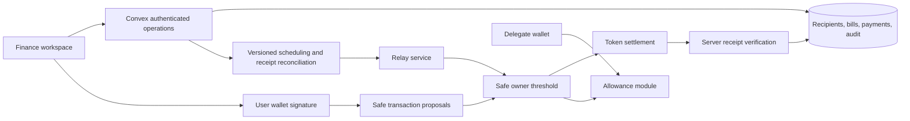

# Disburse v2 architecture review

Reviewed September 5, 2026. This describes the implemented changes and remaining release work. It is not a contract audit or a claim of production readiness.

## System responsibilities

React is responsible for preparing and reviewing instructions. Convex authenticates sessions, checks organization access, stores finance records, applies application policies, schedules work, and verifies payment outcomes. Safe owners authorize ordinary account transactions. Enabled modules provide separate contract authority. Neither the database nor an app role owns the funds.

The persistent workspace shell and semantic design system are shared across all finance pages. Recipient, bill, payment-review, recurring-edit, and team-editor dialogs are focused components. The settings controller performs asynchronous payment work only from user actions, not rendering. Shared validation, chain/token configuration, Safe service URLs, and recurrence date arithmetic now live outside UI components. Route pages load lazily. Session changes notify mounted consumers, protected routes check wallet/session identity, and failed signature requests require an explicit retry.

## Funding accounts and Safe ownership

Linking an account is now a server action followed by an internal mutation. The server requires an organization admin, verifies deployed code, reads current owners and threshold on the selected chain, and requires a verified direct or nested approval path for the caller. The write rechecks organization authorization. This removes reliance on browser-only validation.

The server verifies both proxy runtime and singleton bytecode against the pinned published Safe 1.3.0/1.4.1 deployments. It reads slot zero, verifies the singleton address/code hash, verifies a published factory’s code hash, and evaluates its proxy creation code with a read-only contract-creation call to obtain the expected runtime. Owner/threshold reads use the same block. Account linking, owner proposal preflight and new delegated authorizations apply this check. Unknown versions fail closed. The isolated Sepolia Safe passed this verification. Owner/threshold fields in the database remain snapshots; monitoring for owner, threshold, module and guard changes is still needed.

An organization has at most one active account per chain. Accounts on different chains may have different addresses; funding instructions and QR codes use the selected account. Unlinking archives an account rather than deleting historical payment references. Unfinished payments and active recurring instructions block unlinking. Historical records that lack `isActive` remain active for compatibility.

Onboarding separates app invitations from explicitly selected Safe owners, switches to the selected deployment network, and waits for a successful receipt before linking. A submitted deployment that cannot yet be linked remains available for recovery by its predicted address.

New proposals use the next nonce from the Safe service rather than always reusing the current chain nonce. Service discovery is not an atomic cross-client nonce reservation: concurrent creators can still compete, and scheduled payments must respect the Safe queue. Execution checks the current chain nonce and fails for review when earlier transactions have not completed.

Native and relayed owner execution reuse the exact signed Safe transaction data, recompute its hash, and count distinct current-owner confirmations. The previous reconstruction could discard signed gas fields. Contract-owner signatures are explicitly directed to Safe; the current browser execution path supports ordinary owner signatures. Signing now uses the selected wagmi connector provider, including WalletConnect, rather than assuming `window.ethereum`. Network checks precede Safe initialization. Real connector/device acceptance testing remains necessary.

## Two different spending policies

| Property              | Disburse member policy                                     | Safe allowance module                                      |
| --------------------- | ---------------------------------------------------------- | ---------------------------------------------------------- |
| Enforcement           | Convex mutations                                           | Enabled on-chain module                                    |
| Scope                 | Payments created through this application                  | Transfers authorized by the delegate through that module   |
| Limits                | Allowed currency, whole-payment cap, calendar-month budget | Token amount and fixed reset interval                      |
| Calendar              | UTC planned payment month                                  | Contract reset anchor; 30 days is not a calendar month     |
| Approvals             | Existing application permissions and owner threshold       | Delegate transfers within allowance bypass owner threshold |
| Who changes it        | Organization admins                                        | Safe owners through normal threshold-approved execution    |
| Recipient restriction | Saved recipients for the new batch flow                    | Any address; no recipient allowlist                        |
| Offboarding           | Removes application access                                 | Requires a separate executed revocation                    |

Application budgets reserve all non-cancelled drafts, pending and failed payments against their creator's planned payment month. Cancellation releases reservations. Rechecks happen at draft editing, proposal, scheduling, rescheduling, and both manual and scheduled execution claims. Profile/role edits are atomic and preserve at least one active administrator. Existing transactions already sent to a relay or chain cannot be recalled by changing a database policy. Admins can edit app policies; these policies are operational controls, not constraints on Safe owners.

The first implementation queries indexed payment history to calculate reservations transactionally. This avoids independent counters drifting, but grows with the creator's history. Before high-volume use, introduce monthly reservation records keyed by organization, user, token, and month with atomic adjustments and a reconciliation job. Specify how account/token conversions should affect budgets before supporting them.

## Implemented contract-enforced delegation

Team → Delegated spending uses Safe's published Allowance Module deployments, pinned via `@safe-global/safe-modules-deployments@2.2.22`. It offers available versions explicitly rather than assuming every chain uses one address. In this registry, Ethereum, Polygon, Base, and Sepolia have supported deployments; Arbitrum and Base Sepolia are unavailable in this integration. Unknown addresses are rejected and module code must exist before proposals can be prepared.

The flow:

1. Select a linked account and published module version.
2. Read module status, current owners, every delegate, token grants, amount spent, reset interval, and nonce at one block. Discovery is independent of app membership, so removed members do not disappear from the revocation view. RPC errors produce an unverified state, not a zero allowance.
3. Choose an active team member with a separate wallet, currency, amount, and one-time/daily/7-day/30-day allowance. A Safe owner is not eligible in this UI because an allowance cannot restrict owner authority.
4. Review the authority and sign a normal Safe proposal. Calls enable the module if needed, add the delegate if absent, and set the allowance. All are ordinary calls; no delegate call to arbitrary policy code is constructed.
5. Review, approve, and execute the policy in Disburse’s Policy approvals queue. The queue decodes only supported grant/revoke calls, checks the Safe transaction hash and published batch bytecode, and verifies distinct current-owner signatures. Insufficient approvals and out-of-order nonces disable execution. A proposal is never displayed as an active grant; refresh reads the chain again. The queue reads the first 25 pending transactions and explicitly reports when more remain.
6. Revoke a specific delegate/token allowance using `deleteAllowance`, again through normal owner approval. Other grants remain intact. Until execution the delegate still has authority.

Changing a grant preserves spending already used; the app does not silently call `resetAllowance`. One-time grants have no expiry. Enabling a disabled module with positive dormant grants is blocked in this flow because enabling it could restore existing authority. Owners must review those grants first. Disabling the module suspends grants but does not erase them.

These controls manage published Safe contract authority; no custom contract is deployed. A single-recipient draft or invoice payment can now execute through a spending allowance inside Disburse. The member signs the module’s exact transfer hash, including recipient, amount, token, Safe and allowance nonce. The server verifies that signature, simulates the call, rechecks billing, screening and member budgets, and atomically reserves a global chain/module/Safe/delegate/token/nonce key. Another draft cannot reuse it. Multi-recipient and scheduled payments continue through owner approvals.

Delegated settlement requires two confirmations, the exact module transfer event and matching ERC-20 recipient amount. Its receipt verifier is separate from owner transaction verification. Broadcast receipts must match the complete stored calldata before they can attach to the payment. A rejected or reverted broadcast can resume the same signed authorization; it cannot generate a second authorization for the same draft. A claimed authorization can finish after subscription expiry. Delegate and policy execution currently require native network fees in the signing wallet; neither is represented as a verified stablecoin-fee path.

The module limits token spending, not where money goes, and does not enforce application screening, approver roles, per-payment caps, or employee termination. Do not promise those as contract controls. Stronger delegation needs a separately specified and audited module/guard architecture, including restrictions on alternative execution routes. For now, use separate delegated wallets with modest grants and keep owner keys with the people authorized to control the account.

Offboarding procedure: remove application access, inspect all module versions and other enabled modules in Safe, execute every required revocation, and separately remove owner authority if applicable. App removal alone does not finish offboarding. Policy proposals currently rely on Safe's service and chain events for their durable history; a unified Disburse policy audit/event index is remaining work.

References: [Safe spending limits](https://help.safe.global/articles/3961440620-set-up-and-use-spending-limits), [Safe allowance integration guide](https://docs.safe.global/home/ai-agent-quickstarts/agent-with-spending-limit), [published deployments](https://github.com/safe-global/safe-modules-deployments), [module source](https://github.com/safe-global/safe-modules/tree/main/modules/allowances).

## Payment lifecycle and execution evidence

Status transitions are centralized. Scheduling validates future timestamps, transaction hashes, screening state, and application budgets. Scheduled workers claim a matching version atomically before submitting a relay request. Status writes carry that version and cannot overwrite cancelled or executed records. This reduces duplicate execution and stale-worker races.

Managed submissions persist exact execution calldata and atomically claim a single provider request. An interrupted response is reconciled by Safe hash without automatic resubmission. A minute cron recovers pending jobs; bounded exceptions remain visible on the payment and through a scoped support query. This covers durable submission records, but alert delivery and a complete support interface remain rollout work.

Clients can no longer mark payments executed through the public status mutation. A server action fetches the receipt on the payment's chain and requires a successful transaction, the expected Safe `ExecutionSuccess` hash, and sufficient expected-token transfers from that Safe to the intended recipients. New payments snapshot recipient addresses and names so later directory edits do not rewrite payment intent. Legacy single payments without snapshots need a deliberate migration/review; do not blindly backfill them with today's beneficiary address.

Before approval or execution, a server preflight binds the proposal to saved intent. It accepts canonical direct token transfers or a supported MultiSend/MultiSendCallOnly deployment, rejects extra calls, nested delegate calls, native value, substituted currencies/recipients, and amount changes. The published batch contract bytecode hash is verified. The Safe contract recomputes the transaction hash, including all gas/refund fields, and the fee token must match the saved instruction. Execution verifies distinct current-owner signatures cryptographically and requires the current account nonce. Scheduled workers perform the same checks before claiming submission. Deployment discovery is pinned to `@safe-global/safe-deployments@1.37.50` and supported 1.3.0/1.4.1 batch deployments.

A matching signed hash binds the fee fields, but there is no separate organization-wide fee-amount cap. Owners must review the quoted fee envelope. Receipt verification alone remains a narrower settlement check: it accepts sufficient expected recipient transfers and does not prove the absence of other effects in a manually executed legacy proposal. Owner payments and delegated payments now require at least two mined confirmations. This is a minimum confirmation depth, not a guarantee against reorgs or a claim of L2 finality. A chain-specific finality/reorg policy remains necessary for production operations.

Managed submissions use durable relay jobs, a bounded backend recovery queue and receipt verification. Provider status alone is not payment proof. Ambiguous jobs remain for investigation and can request another settlement check. Only jobs proven never submitted can resume their original approved submission.

New payment and spending-policy proposals and signatures are prepared and persisted by the server in `accountProposals` and `accountSignatures`. Payments and policy changes no longer POST approvals to the Safe transaction service or build transaction batches in the browser. Administrators can request spending grants without being account signers; the account approval threshold controls execution. Grant requests and sends require current member/payment authority. Revocation stays available after subscription expiry. [Policy implementation](SPENDING_POLICY_APPROVALS.md). Direct and nested approvals share one path, current authority verification and atomic account/nonce reservation. Resume preparation restores the original intent to the approval queue. The old `ownerProposals` table is retained read-only for signed evidence; its write API is removed. Original remote proposals can be recovered only after their exact intent and current signatures are verified. See [nested approval details and real receipts](FUNDING_ACCOUNTS.md).

Native execution saves a block checkpoint before the wallet broadcasts. `nativePayments` queries the original Safe hash through the service or bounded account execution logs and verifies the receipt, recipient amounts and confirmations. Its indexed due queue checks up to 20 payments per minute; each log scan covers at most 2,000 blocks with overlap. After 120 unsuccessful checks the original payment needs investigation, with a manual Check settlement action. There is no automatic replacement broadcast. The native recovery path passed a real withheld-hash Sepolia test; browser-wallet rejection/resume remains open. See the [fix-pass report](READINESS_FIX_PASS_2026-09-06.md).

`shared/assets.ts` defines environment and contract-based asset identity. Reports default to production and separate test or unclassified records. New payment preparation pins `tokenAddress`; historical records without it use the configured chain/symbol mapping. Deposit writes are internal and account/destination-validated. Deposit pagination continuation and log identity still need R09 before historical completeness can be claimed.

## Recurrence and invoice data

Recurring instructions generate reviewable drafts three days before the next pay date. They do not sign new transactions or grant indefinite wallet access. Every occurrence needs approval. Monthly recurrence preserves its original day anchor and clamps to shorter months. Version checks and an occurrence index prevent duplicate draft creation. Missed dates, missing recipients, lost creator access, and funding/policy problems pause the series instead of generating a catch-up payment. Resuming advances to the next future occurrence without catch-up payments. Editing a series increments its version and leaves already-created drafts untouched; editing an occurrence cannot silently move it to another recurring period. Pausing a series does not cancel drafts already created.

Bills are separate records linked to disbursements. Duplicate invoice references are checked per organization/vendor. Preparing a payment rejects already-linked non-cancelled payments, requires a single currency, and combines amounts owed to the same vendor exactly. Unpaid bills can be edited or voided without deleting their history. An active linked payment must be cancelled before the bill changes. A paid state follows verified payment state. Both bills and one-time batches support immediate payment after approval or an explicit future payday. Private invoice documents and reviewed extraction are implemented separately; customer invoice issuance/receipts are described in [accounts receivable](ACCOUNTS_RECEIVABLE.md).

## Named accounts and accounting reconciliation

The organization can connect several named Safes on the same network. `safeId`, rather than chain ID alone, is the funding identity on a payment or recurring instruction. A grouped run resolves each selected account before creating any drafts. Bill preparation and draft edits use the same server resolver. Removing an account pauses its bound future work; another same-network account cannot replace it silently. Full details and nested-ownership limits are in [company accounts](FUNDING_ACCOUNTS.md).

`accountingProfiles` records the customer's functional currency and closing policy. `accountingAccounts` and `accountingMappings` retain external ledger identifiers, mapping versions and the asset-holding account at a chain/address/token location. `accountingEntries` stores reviewed settlement facts and immutable monetary lines. `accountingMovements` binds one chain transfer to its current reconciliation, so a transfer between Operations and Payroll or between an invoice address and the Safe is not reconciled twice.

`accountingExports` records durable batches, retry IDs and explicit import acknowledgments. Corrections preserve posted lines and link reversals/replacements; unexported edits retain a voided predecessor. `accountBalanceChecks` retains historical network checkpoints and compares exact unit balances with bounded report pages. Customer book values remain distinct from on-chain quantities. See [accounting implementation and acceptance](ACCOUNTING_RECONCILIATION.md).

The v2 release targets a fresh setup. POC compatibility and migration of unused POC records are not acceptance requirements. Ongoing transaction evidence, audit history, export identity and recovery controls remain part of the product.

## Recipient imports and privacy

CSV/TSV imports accept common employee/vendor names and email aliases, preview rows and duplicates, and support paste from spreadsheets. A name/email directory record may lack a wallet address; it cannot be included in a payment until payout details are supplied. The parser handles quoted multiline fields, escaped quotes, BOMs, duplicate headers, and malformed row shapes. Explicit column mapping supports unfamiliar exports and ambiguous email columns. Unmapped columns are skipped. Saved currency/network preferences survive import, draft editing and recurrence; conflicting payment instructions are rejected. Mixed recipients are grouped by currency/network into separately approved drafts in one atomic mutation. Aggregate per-payment budgets are checked before splitting a currency across networks.

There is no live Gusto connector. A production integration requires approved API access, encrypted refresh credentials, minimum scopes, external identity keys, previewable updates, and auditability. Do not ingest bank or tax records as an incidental side effect of recipient import. Recipient verification and a secure self-service address collection flow remain product work.

## Release and migration checklist

- Run `bun install`, `bun run check`, and `bun run build:check`. Both frontend and Convex TypeScript are checked.
- Review and publish the Convex schema/functions and regenerate bindings against the intended production deployment. New tables: `recurringPayments` and `invoices`; new optional fields and indices cover app policies, receipt snapshots, account archival, occurrence lookups, and signed delegated-payment authorization. The optional allowanceExecution, delegatedBy and delegationKey fields preserve old records; by_delegation_key supports atomic nonce reservation. No destructive migration is included. Development synchronization is part of this work; production was not deployed. The development database contained historical audit metadata arrays/objects, so the audit schema preserves those legacy shapes while `appendAudit` continues normalizing new metadata to flat primitive values. No audit records were rewritten or deleted.
- Configure `RPC_URL_<chainId>` on the Convex deployment for reliable receipt/account reads; default public endpoints are fallbacks. Browser reads accept VITE_RPC_URL_<chainId> (and the existing VITE_SEPOLIA_RPC_URL); these must be public client transports, never private provider credentials. Provide monitored transports before larger deployments.
- Verify existing SIWE domain restrictions, session settings, relay credentials, billing/webhook configuration, and network-specific funding/token details in the target environment. Never put service credentials in `VITE_` variables.
- Rehearse using an isolated test Safe: 2-of-3 approvals, failed signatures, grant/spend/exceed/reset/revoke, removed delegates, dormant module grants, two simultaneous payments, scheduled cancellation, relay timeout, and a recipient address changed after draft creation. Add deployed-contract/fork integration tests before enabling delegation for production customers.
- Run `bun run test:e2e` for the read-only browser suite. All workspace routes, CSV previews, payment/bill/recurrence dialogs, delegation, dark appearance, and mobile layout/navigation have been tested locally in Chromium. Repeat with real authenticated sessions, supported wallets, assistive technology, and production-like network failures before release.
- Translate new English flows into the supported locales. Exercise a real customer export, not only representative CSV fixtures.

Funded Sepolia owner batches, invoice reconciliation, module grants, delegated transfers, replay rejection and revocation have been executed against an isolated Safe. See QA_V2.md for receipts and the distinction between browser fixtures, live backend execution and remaining acceptance. No external payroll integration, production provider onboarding, or independent security audit was performed.

## Relay provider change discovered September 5

The existing Safe Relay Kit/SyncFee integration depends on a deprecated Gelato path. Gelato archived its legacy SDK in February 2026 and its migration guide says SyncFee is being removed. The replacement Turbo Relayer sponsors calls through a Gas Tank; it does not automatically reproduce fee collection from a Safe. A replacement must preserve owner-approved payment/fee intent, use server-only provider credentials, reconcile provider requests durably, and collect any customer fee explicitly. The replacement is now implemented with Gelato Turbo Relayer and an explicit owner-approved fee transfer in the Safe batch; the deprecated relay dependency and submission endpoints are removed. Live provider verification remains blocked by missing project configuration. No application-managed gas wallet is used. See [managed relay implementation and acceptance](MANAGED_RELAY.md). [SDK notice](https://github.com/gelatodigital/relay-sdk), [migration guide](https://github.com/gelatodigital/gelato-migration-erc2271-syncfee), [Turbo quick start](https://docs.gelato.cloud/gasless-with-relay/gelato-turbo-relayer/quick-start).

## Licenses and ownership

License state is independent of account authority. `billing` keeps paid receipts/periods separate from operator grants and a permanent free fallback. `licenseTiers`, `licensePrograms` and `licenseEvents` support reusable free tiers, future signup terms, and private operator audit history. Only signed-in wallets in `DISBURSE_LICENSE_OPERATORS` may change these records. Revisions, request identities and active-checkout checks prevent conflicting grants or duplicate changes.

The current product keeps core payments, scheduling and collection available after expiry. Tier capacity governs additional seats and saved beneficiaries. License mutations never change Safe owners, thresholds, contracts or balances. Customer screening and spending policies remain enforced in the app. Specialized-report and provider-service gates are future packaging decisions. Customers pay every network and provider fee. See [licensing](LICENSE_MANAGEMENT.md).
