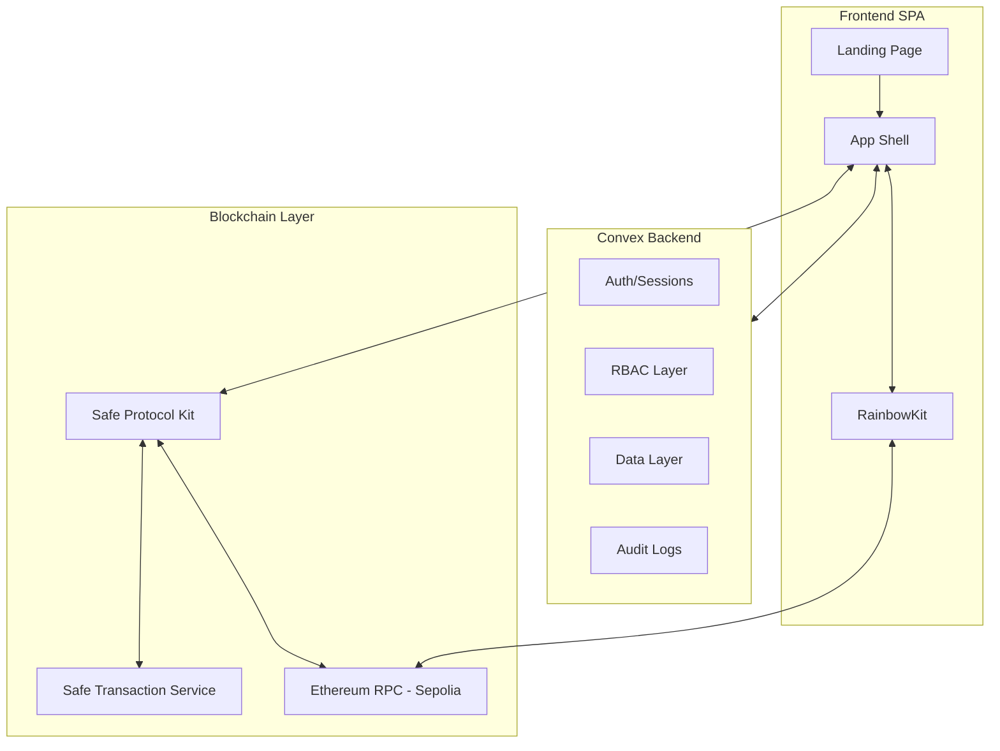
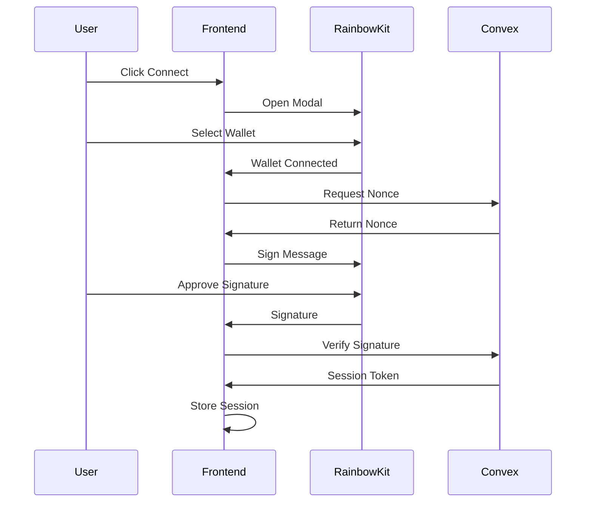

# Stablecoin Treasury Manager MVP Implementation Plan

## Tech Stack

| Layer | Technology |

|-------|------------|

| Frontend | React 19 + Vite + TypeScript |

| Styling | Tailwind CSS + shadcn/ui |

| Wallet | RainbowKit + wagmi v2 + viem |

| Backend | Convex |

| Blockchain | Safe Protocol Kit + Safe API Kit |

| Network | Sepolia Testnet |

| Tokens | USDC, USDT (testnet addresses) |

| Runtime | Bun |

| Hosting | Cloudflare Pages |

## Architecture Overview



---

## Phase 1: Project Scaffolding (Landing Page Only)

Initialize a minimal project for the landing page deployment.

**Initial Directory Structure:**

```
disburse/
├── src/
│   ├── components/
│   │   ├── ui/           # shadcn components
│   │   └── landing/      # Landing page components
│   ├── pages/
│   │   └── Landing.tsx
│   ├── lib/
│   │   └── utils.ts
│   └── App.tsx
├── public/
│   └── _redirects        # Cloudflare Pages SPA routing
├── package.json
├── vite.config.ts
└── tailwind.config.js
```

**Phase 1 Dependencies (minimal):**

- `react`, `react-dom`, `react-router-dom`
- `tailwindcss`, `@radix-ui/*` (via shadcn)
- `lucide-react` (icons)
- `framer-motion` (animations)

---

## Phase 2: Landing Page + Deploy

Build a professional, modern landing page and deploy immediately to Cloudflare Pages.

### Landing Page Sections

1. **Navigation Header**

   - Logo/brand name
   - "Login" button (links to `/login`, placeholder for now)
   - "Try For Free" button (primary CTA)

2. **Hero Section**

   - Bold headline: "Treasury Management for Web3 Teams"
   - Subheadline explaining non-custodial stablecoin disbursements
   - Two CTAs: "Try For Free" (primary) + "Learn More" (secondary)
   - Subtle animated background or gradient

3. **Features Grid** (4-6 cards)

   - Non-Custodial: Your keys, your funds
   - Safe-Powered: Built on Gnosis Safe
   - Audit Trail: Complete transaction history
   - Stablecoin Native: USDC, USDT support
   - Role-Based Access: Team permissions
   - Simple Billing: Pay in stablecoins

4. **How It Works** (3-step flow)

   - Connect your Safe
   - Add beneficiaries
   - Send payments

5. **CTA Section**

   - "Start your 30-day free trial"
   - "Try For Free" button

6. **Footer**

   - Links (placeholder): Docs, Support, Terms, Privacy
   - Copyright

### Design Direction

- **Theme**: Dark mode with deep navy/charcoal background
- **Accent**: Vibrant teal/cyan gradient for CTAs and highlights
- **Typography**: Satoshi or Plus Jakarta Sans (distinctive, modern)
- **Effects**: Subtle gradient orbs, smooth fade-in animations on scroll
- **Layout**: Generous whitespace, large typography, clear visual hierarchy

### Cloudflare Pages Deployment

- Create `public/_redirects` file for SPA routing: `/* /index.html 200`
- Build command: `bun run build`
- Install command: `bun install`
- Output directory: `dist`
- Connect GitHub repo to Cloudflare Pages for auto-deploy

---

## Phase 3: Backend + Wallet Setup (Post-Deploy)

After the landing page is live, add the remaining dependencies:

- `@rainbow-me/rainbowkit`, `wagmi`, `viem`, `@tanstack/react-query`
- `convex`

Expand directory structure:

```
├── convex/
│   ├── schema.ts
│   ├── auth.ts
│   ├── users.ts
│   ├── orgs.ts
│   ├── beneficiaries.ts
│   ├── disbursements.ts
│   └── audit.ts
├── src/
│   ├── lib/
│   │   ├── wagmi.ts      # Wallet config
│   │   └── convex.ts     # Convex client
```

---

## Phase 4: Wallet Authentication

Implement SIWE (Sign-In with Ethereum) flow with Convex:



**Convex Functions:**

- `auth.generateNonce` - Create challenge nonce
- `auth.verifySignature` - Verify SIWE signature, create/update user, issue session
- `auth.getSession` - Validate active session

---

## Phase 5: Convex Data Layer

Define schema in `convex/schema.ts`:

```typescript
// Core tables based on architecture doc
users: { walletAddress, email?, createdAt }
orgs: { name, createdBy, createdAt }
orgMemberships: { orgId, userId, role, status }
safes: { orgId, chainId, safeAddress }
beneficiaries: { orgId, name, walletAddress, notes, isActive }
disbursements: { orgId, safeId, beneficiaryId, token, amount, memo, status, safeTxHash, txHash }
billing: { orgId, plan, trialEndsAt, paidThroughAt, status }
auditLog: { orgId, actorUserId, action, objectType, objectId, metadata, timestamp }
```

**RBAC Enforcement:**

- Helper function to check user role before mutations
- Roles: Admin, Approver, Initiator, Clerk, Viewer

---

## Phase 6: Core Application Features

Add Safe Protocol dependencies when this phase starts:

- `@safe-global/protocol-kit`, `@safe-global/api-kit`

### 6.1 Org Management

- `/select-org` - List user's orgs, create new org
- Org creation flow creates billing record with 30-day trial

### 6.2 Safe Integration

- Use Safe Protocol Kit to deploy new Safe or link existing
- Store Safe address in Convex
- Fetch Safe balances via viem

### 6.3 Beneficiaries CRUD (`/org/:id/beneficiaries`)

- List, create, edit, deactivate beneficiaries
- Validate wallet addresses

### 6.4 Disbursements (`/org/:id/disbursements`)

- Create disbursement draft in Convex
- Build ERC20 transfer tx via Safe Protocol Kit
- Propose to Safe Transaction Service
- Execute (single-signer MVP)
- Update Convex with txHash
- Real-time status updates

### 6.5 Dashboard (`/org/:id/dashboard`)

- Safe balance (USDC, USDT)
- Recent disbursements
- Quick actions

---

## Phase 7: Billing and Settings

### Billing (`/org/:id/billing`)

- Display trial status / paid status
- Stablecoin payment via in-app disbursement to platform wallet

### Settings (`/org/:id/settings`)

- Org name
- Team members (invite, change roles)
- Connected Safe details

---

## Token Addresses (Sepolia)

| Token | Address |

|-------|---------|

| USDC | `0x1c7D4B196Cb0C7B01d743Fbc6116a902379C7238` |

| USDT | `0x7169D38820dfd117C3FA1f22a697dBA58d90BA06` |

---

## Routes Summary

| Route | Description |

|-------|-------------|

| `/` | Landing page |

| `/login` | Wallet connection + SIWE |

| `/select-org` | Org selection/creation |

| `/org/:id/dashboard` | Main dashboard |

| `/org/:id/beneficiaries` | Beneficiary management |

| `/org/:id/disbursements` | Payment management |

| `/org/:id/billing` | Subscription management |

| `/org/:id/settings` | Org settings |

---

## Implementation Order

**Milestone 1: Landing Page Live**

1. Project scaffold (Vite + React + Tailwind)
2. Build landing page with all sections
3. Deploy to Cloudflare Pages

**Milestone 2: Auth Working**

4. Add Convex + RainbowKit dependencies
5. Implement wallet authentication

**Milestone 3: Core Features**

6. Org management + RBAC
7. Safe integration
8. Beneficiaries CRUD
9. Disbursements flow
10. Dashboard

**Milestone 4: MVP Complete**

11. Billing system
12. Settings pages